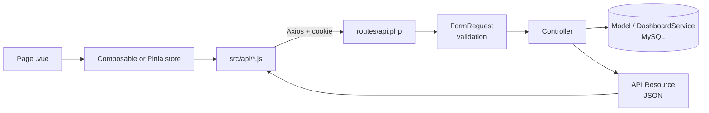

# 🪙 Coiny — Personal Finance Tracker

Coiny is a small web app that helps you **record your income and expenses**, **organise them into
categories**, and **see your balance and a visual summary** on one dashboard.

> We built Coiny as our 4th-year college project. Our goal was to keep it simple: record money
> in and out, organise it, compute the balance, and show a summary. It is **not** an accounting system.

---

## 📑 Table of Contents

1. [Features](#-features)
2. [Tech Stack](#-tech-stack)
3. [Project Structure](#-project-structure)
4. [Running the App](#-running-the-app)
5. [Running the Tests](#-running-the-tests)
6. [Troubleshooting](#-troubleshooting)
7. [API Documentation (Postman)](#-api-documentation-postman)
8. [Project Modules and How Vue Shows Them](#-project-modules-and-how-vue-shows-them)
9. [Business Rules Cheat Sheet](#-business-rules-cheat-sheet)
10. [Team](#-team)

---

## ✨ Features

- Create an account and log in securely. Every new account starts with **12 ready-made categories**.
- Add, edit, delete, filter, and search **transactions**.
- Manage your own **income and expense categories**.
- A **dashboard** with totals, balance, a pie chart of expenses, and an income-vs-expenses chart.
- Choose the period: this month, last month, or custom dates.
- **Light / Dark / System** theme.
- Works on phones (360px) up to desktops (1440px).

---

## 🧰 Tech Stack

| Part | Technology |
|---|---|
| Backend (API) | PHP 8.3+, Laravel, Laravel Sanctum (cookie-based login) |
| Database | MySQL 8 |
| Frontend | Vue 3 (`<script setup>`), Vue Router, Pinia, Axios |
| Styling and charts | Tailwind CSS, Chart.js with vue-chartjs |
| Tools | Vite, Composer, npm, PHPUnit, Laravel Pint, ESLint, Prettier |

**In one sentence:** Vue shows the screens, Laravel does all the work and the math, and only Laravel
talks to MySQL.

```
 Browser (Vue)  ──JSON over HTTP──▶  Laravel API  ──SQL──▶  MySQL
```

---

## 🗂 Project Structure

```
coiny-app/
├─ backend/     Laravel API (no HTML pages, it only returns JSON)
├─ frontend/    Vue single-page app (everything the user sees)
├─ docs/        Coiny.postman_collection.json
└─ README.md    You are here
```

---

## 🚀 Running the App

### 1. What you need first

Install these tools and check that each command prints a version:

| Tool | Version | Check with |
|---|---|---|
| PHP | 8.3 or newer | `php -v` |
| Composer | 2.x | `composer -V` |
| MySQL | 8.0 or newer | `mysql --version` |
| Node.js | 20 LTS or newer | `node -v` |

### 2. Set up the backend

Open a terminal in the project folder:

```bash
cd backend
composer install                      # download PHP packages
cp .env.example .env                  # create your settings file
php artisan key:generate              # create the app secret key
```

Open `backend/.env` and put your MySQL username and password:

```env
DB_USERNAME=root
DB_PASSWORD=your_mysql_password
```

Create the two databases (one for the app and one for the tests):

```bash
mysql -u root -p -e "CREATE DATABASE coiny CHARACTER SET utf8mb4 COLLATE utf8mb4_unicode_ci;
                     CREATE DATABASE coiny_test CHARACTER SET utf8mb4 COLLATE utf8mb4_unicode_ci;"
```

Create the tables and add the demo data, then start the server:

```bash
php artisan migrate:fresh --seed      # build the tables + demo data
php artisan serve                     # API runs on http://127.0.0.1:8000
```

> ⚠️ `migrate:fresh` **deletes all data**. Only run it on your local database.

### 3. Set up the frontend

Open a **second terminal** (keep the backend running):

```bash
cd frontend
npm install                           # download JavaScript packages
cp .env.example .env                  # sets VITE_CURRENCY=USD
npm run dev                           # app runs on http://localhost:5173
```

### 4. Open the app

Go to **http://localhost:5173** and log in with the demo account:

| Email | Password |
|---|---|
| `demo@coiny.test` | `password` |

The demo account already has about 4 months of transactions, so the charts are not empty.

> 💡 Always use `localhost:5173`, **not** `127.0.0.1:5173`. The login cookie is set for `localhost`.

### Useful commands

| Where | Command | What it does |
|---|---|---|
| backend | `php artisan serve` | Start the API |
| backend | `php artisan migrate:fresh --seed` | Reset the database with demo data |
| backend | `./vendor/bin/pint` | Format PHP code |
| frontend | `npm run dev` | Start the Vue app |
| frontend | `npm run build` | Build the app for production |
| frontend | `npm run lint` | Check JavaScript/Vue code |

---

## 🧪 Running the Tests

The tests use the `coiny_test` database, so your real data is never touched.

```bash
cd backend
php artisan test                      # run all tests
php artisan test --filter=Isolation   # check that users can't see each other's data
./vendor/bin/pint --test              # check code style only, without changing files
```

The tests are in `backend/tests/Feature/`, grouped into `Auth`, `Categories`, `Transactions`,
`Dashboard`, and `Isolation`.

---

## 🩺 Troubleshooting

| Problem | Likely cause and fix |
|---|---|
| **419 CSRF token mismatch** | In `backend/.env`, set `SANCTUM_STATEFUL_DOMAINS=localhost:5173` (with the port) and `SESSION_DOMAIN=localhost`. Open the app on `localhost`, not `127.0.0.1`. |
| **401 right after logging in** | The backend is not running, or you opened the app on `127.0.0.1`. |
| **Errors come back as HTML** | The request is missing the `Accept: application/json` header. |
| **`SQLSTATE` / connection refused** | MySQL is not running, or the password in `backend/.env` is wrong. |
| **Port 5173 is already in use** | Another Vite app is running. Stop it, because Coiny needs port 5173. |

---

## 📮 API Documentation (Postman)

### Basics

| Item | Value |
|---|---|
| Base URL | `http://localhost:8000` |
| Prefix | Every endpoint starts with `/api` (except `/sanctum/csrf-cookie`) |
| Format | JSON in, JSON out |
| Auth | Session **cookie** (Laravel Sanctum, SPA mode). There is no Bearer token. |
| Money | Always a **string** with 2 decimals, for example `"250.00"` |
| Dates | `YYYY-MM-DD`, for example `"2026-09-15"` |

### How login works (read this before Postman)

Coiny uses cookies, like a normal website:

1. `GET /sanctum/csrf-cookie` → the server gives you an `XSRF-TOKEN` cookie.
2. Every `POST`, `PUT`, or `DELETE` must send that token back in the `X-XSRF-TOKEN` header.
3. `POST /api/login` → the server gives you a session cookie, and from now on you are logged in.
4. Laravel only accepts the session cookie when the request says it came from the frontend,
   so every request also sends `Referer: http://localhost:5173`.

The Vue app does all of this automatically. In Postman, **our collection does it for you.**

### Set up Postman in 4 steps

1. Start the backend (`php artisan serve`).
2. In Postman, click **Import** and choose `docs/Coiny.postman_collection.json`.
3. Open the collection and run **1. Auth → Get CSRF cookie**.
4. Run **1. Auth → Login** (it uses the demo account). You can now call any request.

The collection uses these variables. You can edit them in the collection's **Variables** tab:

| Variable | Default | Filled by |
|---|---|---|
| `base_url` | `http://localhost:8000` | you |
| `frontend_url` | `http://localhost:5173` | you |
| `xsrf_token` | — | automatically, after each response |
| `today` | — | automatically, before each request |
| `expense_category_id` | — | **List categories** |
| `category_id` | — | **Create category** |
| `transaction_id` | — | **Create transaction** |

> 💡 Run **List categories** before **Create transaction**, so `expense_category_id` has a value.

### Status codes

| Code | Meaning |
|---|---|
| `200` | OK (read or update) |
| `201` | Created |
| `204` | Done, with no body (delete, logout, password change) |
| `401` | You are not logged in |
| `404` | Not found, **or it belongs to another user** (we never say which) |
| `409` | The category is used by transactions and cannot be deleted |
| `419` | The CSRF token is missing or old. Run **Get CSRF cookie** again. |
| `422` | Validation error (see the `errors` object) |
| `429` | Too many requests (login: 5 tries per minute) |

**Error format** (the standard Laravel format):

```json
{
  "message": "The amount field must be greater than 0.",
  "errors": { "amount": ["The amount field must be greater than 0."] }
}
```

---

### 🔐 Auth

| Method | Endpoint | Auth? | Success |
|---|---|---|---|
| GET | `/sanctum/csrf-cookie` | No | 204 |
| POST | `/api/register` | No | 201 |
| POST | `/api/login` | No | 200 |
| POST | `/api/logout` | Yes | 204 |
| GET | `/api/user` | Yes | 200 |

**POST `/api/register`** creates the user and the 12 default categories, then logs the user in.

```json
{ "name": "Sara Ali", "email": "sara@example.com",
  "password": "secret123", "password_confirmation": "secret123" }
```

| Field | Rules |
|---|---|
| `name` | required, max 100 characters |
| `email` | required, valid email, unique (saved in lowercase) |
| `password` | required, at least 8 characters, must match `password_confirmation` |

**POST `/api/login`**

```json
{ "email": "demo@coiny.test", "password": "password" }
```

Response (register, login, and `GET /api/user` all return this shape):

```json
{ "data": { "id": 1, "name": "Demo User", "email": "demo@coiny.test",
            "created_at": "2026-09-26T10:00:00+00:00" } }
```

Wrong password → `422` on `email`. A 6th attempt within one minute → `429`.

---

### 👤 Profile

| Method | Endpoint | Body | Success |
|---|---|---|---|
| PUT | `/api/profile` | `{ "name": "New Name" }` | 200 + user |
| PUT | `/api/profile/password` | see below | 204 |

```json
{ "current_password": "password", "password": "newpassword1",
  "password_confirmation": "newpassword1" }
```

The new password must be at least 8 characters, must match the confirmation, and must be different
from the current one.

---

### 🏷 Categories

| Method | Endpoint | Purpose | Success |
|---|---|---|---|
| GET | `/api/categories` | List all (optional `?type=income` or `?type=expense`) | 200 |
| POST | `/api/categories` | Create | 201 |
| PUT | `/api/categories/{id}` | Rename (only the name) | 200 |
| DELETE | `/api/categories/{id}` | Delete | 204 |

**POST `/api/categories`**

```json
{ "name": "Coffee", "type": "expense" }
```

Response:

```json
{ "data": { "id": 13, "name": "Coffee", "type": "expense", "transactions_count": 0,
            "created_at": "...", "updated_at": "..." } }
```

| Rule | Result if broken |
|---|---|
| `name` is required, max 50 characters | 422 |
| `type` is `income` or `expense` | 422 |
| The name is unique inside the same type (case doesn't matter). The same name can exist in both types. | 422 |
| On rename, `type` is ignored. A category's type can never change. | — |
| A category that has transactions can't be deleted | **409** |

---

### 💸 Transactions

| Method | Endpoint | Purpose | Success |
|---|---|---|---|
| GET | `/api/transactions` | List with filters and pages | 200 |
| POST | `/api/transactions` | Create | 201 |
| GET | `/api/transactions/{id}` | Show one | 200 |
| PUT | `/api/transactions/{id}` | Replace (send **all** fields) | 200 |
| DELETE | `/api/transactions/{id}` | Delete forever | 204 |

**POST / PUT body**

```json
{ "type": "expense", "amount": "35.50", "category_id": 5,
  "transaction_date": "2026-09-15", "description": "Lunch with friends" }
```

| Field | Rules |
|---|---|
| `type` | required, `income` or `expense` |
| `amount` | required, greater than 0, max 2 decimals, max `9999999999.99`. It is never negative, because the direction comes from `type`. |
| `category_id` | required, must be **your** category **and** have the **same type** as the transaction |
| `transaction_date` | required, `YYYY-MM-DD`, from `2000-01-01` up to tomorrow |
| `description` | optional, max 255 characters |

Response:

```json
{ "data": {
  "id": 120, "type": "expense", "amount": "35.50", "transaction_date": "2026-09-15",
  "description": "Lunch with friends", "category_id": 5,
  "category": { "id": 5, "name": "Food", "type": "expense" },
  "created_at": "...", "updated_at": "..." } }
```

**GET `/api/transactions` query parameters** (all optional, and they combine with AND):

| Param | Example | Meaning |
|---|---|---|
| `type` | `expense` | Only income or only expenses |
| `category_id` | `5` | Only one category |
| `date_from` / `date_to` | `2026-09-01` | Date range (both days included) |
| `search` | `lunch` | Text inside the description |
| `page` | `2` | Page number |
| `per_page` | `15` | Items per page (default 15, max 100) |

The newest transactions come first. The response is paginated:

```json
{ "data": [ /* transactions */ ],
  "links": { "first": "...", "last": "...", "prev": null, "next": "..." },
  "meta": { "current_page": 1, "last_page": 4, "per_page": 15, "total": 56 } }
```

---

### 📊 Dashboard

**GET `/api/dashboard`**

| Param | Values |
|---|---|
| `period` | `this_month` (default), `last_month`, `custom` |
| `from`, `to` | Required when `period=custom`. `from ≤ to`, at most 366 days, both days included. |

Example: `/api/dashboard?period=custom&from=2026-06-01&to=2026-09-30`

```json
{ "data": {
  "period": { "key": "this_month", "from": "2026-09-01", "to": "2026-09-30" },
  "totals": { "income": "2500.00", "expenses": "1200.00", "balance": "1300.00",
              "transactions_count": 37 },
  "all_time_balance": "5400.00",
  "expense_by_category": [
    { "category_id": 3, "name": "Food", "total": "450.00", "percentage": 37.5 }
  ],
  "income_vs_expenses": { "granularity": "day", "points": [
    { "bucket": "2026-09-01", "income": "0.00", "expenses": "35.50" }
  ] },
  "recent_transactions": [ /* up to 5 transactions */ ]
} }
```

- `balance = income − expenses` for the period. It can be negative.
- `granularity` is `day` when the period is 31 days or shorter, and `month` when it is longer.
  `bucket` is then `2026-09-01` or `2026-09`.
- Every day (or month) in the period appears in `points`, even when it is empty (`"0.00"`).
- `percentage` is rounded to 1 decimal, so the total may not be exactly 100.

---

## 🧩 Project Modules and How Vue Shows Them

### The big picture



**Example: adding a transaction**

1. The user fills in `TransactionFormModal.vue` and clicks **Save**.
2. The modal calls `createTransaction()` in `src/api/transactions.js`.
3. Axios sends `POST /api/transactions` with the cookie and the CSRF header.
4. Laravel's `TransactionRequest` validates the data. If something is wrong, it returns 422 and
   `useFormErrors` shows the message under the field. The modal stays open.
5. `TransactionController@store` saves the row **for the logged-in user** and returns
   `TransactionResource`.
6. Vue closes the modal, shows a green toast, and reloads the list.

### How the frontend is organised

| Folder | Job | Example |
|---|---|---|
| `pages/` | One file per screen | `DashboardPage.vue` |
| `components/` | Reusable pieces of a screen | `StatCard.vue`, `BaseModal.vue` |
| `layouts/` | The page frame | `AppLayout.vue` (sidebar), `AuthLayout.vue` |
| `api/` | The **only** place that calls Axios | `transactions.js` |
| `stores/` (Pinia) | Data shared between pages | `auth`, `categories`, `ui` |
| `composables/` | Page logic you can reuse | `useTransactions`, `useDashboard` |
| `router/` | URLs and login guards | `index.js` |
| `utils/` | Small helpers | `money.js`, `dates.js`, `palette.js` |

### Module 1: Authentication

| | |
|---|---|
| **Backend** | `AuthController`, `RegisterRequest`, `LoginRequest`, `UserResource` |
| **Vue pages** | `LoginPage.vue`, `RegisterPage.vue` inside `AuthLayout.vue` |
| **State** | `stores/auth.js` keeps the current user and offers `login()`, `register()`, `logout()` |
| **Guards** | `router/index.js`: guests can only open `/login` and `/register`, and logged-in users are sent to `/dashboard` |

- When the app opens, `auth.init()` calls `GET /api/user` once to check if a session exists.
- `api/http.js` handles the cookies. It gets the CSRF cookie before the first write, retries once
  on 419, and sends the user to `/login?expired=1` on 401.
- After 5 failed logins, the login page shows "Too many login attempts".

### Module 2: Categories

| | |
|---|---|
| **Backend** | `CategoryController`, `CategoryRequest`, `CategoryResource`, `Category::createDefaultsFor()` |
| **Vue page** | `CategoriesPage.vue` at `/categories` |
| **Components** | `CategoryGroup.vue` (one list for income, one for expense), `CategoryFormModal.vue`, `ConfirmDialog.vue` |
| **State** | `stores/categories.js`: loaded once and shared, because the transaction form and the filters need it too |

- Each category shows how many transactions use it (`transactions_count`).
- Deleting a category that is in use returns 409, and Vue shows the error in a red toast.

### Module 3: Transactions

| | |
|---|---|
| **Backend** | `TransactionController`, `TransactionRequest`, `TransactionIndexRequest`, `TransactionResource` |
| **Vue page** | `TransactionsPage.vue` at `/transactions` |
| **Components** | `TransactionFilters.vue`, `TransactionList.vue` (a table on desktop, cards on mobile), `TransactionFormModal.vue`, `PaginationBar.vue` |
| **Logic** | `composables/useTransactions.js` |

- Filters and the page number are saved in the **URL**, for example
  `/transactions?type=expense&page=2`. Reloading or sharing the link keeps the same view.
- The category list in the form only shows categories of the selected type.
- Every delete asks for confirmation first.

### Module 4: Dashboard and Charts

| | |
|---|---|
| **Backend** | `DashboardController`, `DashboardRequest`, `DashboardService` (all SQL sums), `Support/Period.php` |
| **Vue page** | `DashboardPage.vue` at `/dashboard` |
| **Components** | `PeriodPicker.vue`, `StatCard.vue` (income, expenses, balance), `IncomeExpenseChart.vue` (bars), `ExpenseBreakdown.vue` (doughnut + legend), `RecentTransactions.vue` |
| **Logic** | `composables/useDashboard.js` |

- The chosen period is saved in the URL (`?period=last_month`).
- **Vue does no money math.** It only formats the numbers the API already calculated
  (`utils/money.js` uses `Intl.NumberFormat`).
- Each category always has the same chart colour. Colours come from `utils/palette.js`.

### Module 5: Profile and Appearance

| | |
|---|---|
| **Backend** | `ProfileController`, `ProfileRequest`, `PasswordRequest` |
| **Vue page** | `ProfilePage.vue` at `/profile` |
| **Components** | `ThemeSwitcher.vue` (also in the sidebar and on the auth pages) |
| **State** | `stores/ui.js` holds the theme (saved in `localStorage` as `coiny-theme`) and the toasts |

### Shared UI behaviour

Every screen handles the same five states:

| State | What the user sees |
|---|---|
| Loading | A spinner, with the buttons disabled |
| Empty | A short message and an action button (`EmptyState.vue`) |
| Validation error (422) | A red message under the field |
| Network or server error | A red toast, and the old data stays on screen |
| Success | A green toast for 3 seconds |

---

## 📏 Business Rules Cheat Sheet

The server checks every rule. The frontend may check some of them too, but only to help the user.

| ID | Rule |
|---|---|
| BR-01 | Amount > 0, max 2 decimals. Never negative. |
| BR-02 | The transaction type must match the category type. |
| BR-03 | You can only use your own categories. |
| BR-04 | A category's type can't be changed. |
| BR-05 | New users get 12 default categories. |
| BR-06 | Category names are unique per type (case doesn't matter). |
| BR-07 | A category that is in use can't be deleted (409). |
| BR-08 | Deleting a transaction is permanent. |
| BR-09 | The date is between 2000-01-01 and tomorrow. |
| BR-10 | The description is optional, max 255 characters. |
| BR-11 | Balance = income − expenses. It can be negative. |
| BR-12 | Periods: this month, last month, or custom (≤ 366 days). |
| BR-13 | The chart is daily for ≤ 31 days and monthly otherwise. Empty days are filled with zero. |
| BR-14 | One currency (USD by default, set with `VITE_CURRENCY`). |
| BR-15 | Password ≥ 8 characters. Login is limited to 5 tries per minute. |
| BR-16 | 15 items per page by default (max 100), newest first. |
| BR-17 | All totals are calculated in the database, never in Vue. |
| BR-18 | You only ever see your own data. Other users' data returns 404. |

**Default categories:** Income: Salary, Freelance, Gift, Other Income ·
Expense: Food, Transportation, Education, Shopping, Bills, Health, Entertainment, Other Expense.

---

## 👥 Team

| Name | Role |
|---|---|
| محمود الحلو | Backend |
| حمزة عريف | Frontend |
| عطية إحميد | Analysis, documentation, and testing |

The full requirements are in the SRS document (`Coiny_SRS_v1.1.docx`, in Arabic).
