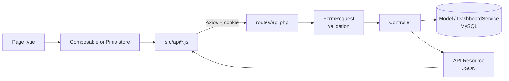

# Coiny — Personal Finance Tracker

Coiny is a small web app for keeping track of your money. You write down what comes in and what goes out, sort it into categories, and the dashboard shows your balance along with a couple of charts.

We built it as our 4th-year college project and deliberately kept it small. It isn't an accounting system — it just records income and expenses, organises them, works out the balance, and shows you a summary.

## How to Run the Project

Coiny has two parts that run side by side: a Laravel API in `backend/` and a Vue app in `frontend/`. You'll need two terminal windows, one for each.

### Before you start

Make sure these are installed. Each command in brackets should print a version number:

- PHP 8.3 or newer (`php -v`)
- Composer 2 (`composer -V`)
- MySQL 8.0 or newer (`mysql --version`)
- Node.js 20 LTS or newer (`node -v`)

### Running the backend

In the first terminal, go into the backend folder, install the PHP packages, and create your local settings file:

```bash
cd backend
composer install
cp .env.example .env
php artisan key:generate
```

Open `backend/.env` and fill in your MySQL username and password:

```env
DB_USERNAME=root
DB_PASSWORD=your_mysql_password
```

Next, create two databases: `coiny` for the app itself and `coiny_test` for the automated tests.

```bash
mysql -u root -p -e "CREATE DATABASE coiny CHARACTER SET utf8mb4 COLLATE utf8mb4_unicode_ci;
                     CREATE DATABASE coiny_test CHARACTER SET utf8mb4 COLLATE utf8mb4_unicode_ci;"
```

Now build the tables, load the demo data, and start the API:

```bash
php artisan migrate:fresh --seed
php artisan serve
```

The API is now running at http://127.0.0.1:8000. Leave this terminal open.

A word of warning: `migrate:fresh` wipes every table before rebuilding them, so only ever run it against your local database.

### Running the frontend

In the second terminal, install the JavaScript packages, copy the settings file (it sets the display currency to USD), and start the dev server:

```bash
cd frontend
npm install
cp .env.example .env
npm run dev
```

### Opening the app

Go to **http://localhost:5173** and sign in with the demo account — email `demo@coiny.test`, password `password`. It comes with about four months of sample transactions, so the charts have something to show straight away.

Use `localhost`, not `127.0.0.1`. The login cookie is issued for `localhost`, and if you mix the two you'll get logged out or see CSRF errors.

### Other handy commands

From `backend/`:

- `php artisan serve` starts the API
- `php artisan migrate:fresh --seed` resets the database and reloads the demo data
- `./vendor/bin/pint` formats the PHP code

From `frontend/`:

- `npm run dev` starts the Vue app
- `npm run build` builds the app for production
- `npm run lint` checks the JavaScript and Vue code

## Running the Tests

The tests run against the separate `coiny_test` database, so they never touch your real data.

```bash
cd backend
php artisan test                      # everything
php artisan test --filter=Isolation   # just the "users can't see each other's data" tests
./vendor/bin/pint --test              # check code style without changing any files
```

You'll find them in `backend/tests/Feature/`, split into `Auth`, `Categories`, `Transactions`, `Dashboard`, and `Isolation`.

## When Something Goes Wrong

Most setup problems come down to one of these:

- **"419 CSRF token mismatch"** — check that `backend/.env` has `SANCTUM_STATEFUL_DOMAINS=localhost:5173` (including the port) and `SESSION_DOMAIN=localhost`, and that you opened the app on `localhost` rather than `127.0.0.1`.
- **Logged out (401) right after signing in** — either the backend isn't running, or you're on `127.0.0.1` instead of `localhost`.
- **Errors come back as an HTML page instead of JSON** — the request is missing the `Accept: application/json` header.
- **`SQLSTATE` or "connection refused"** — MySQL isn't running, or the password in `backend/.env` is wrong.
- **Port 5173 is already in use** — another Vite project is running. Stop it first; Coiny expects that port.

## What Coiny Can Do

- Sign up and log in. Every new account starts with 12 ready-made categories.
- Add, edit, delete, filter, and search transactions.
- Create and manage your own income and expense categories.
- See a dashboard with your totals, your balance, a breakdown of expenses by category, and an income-vs-expenses chart.
- Look at this month, last month, or any custom date range.
- Switch between light, dark, or your system's theme.
- Use it comfortably on anything from a 360px phone to a 1440px desktop.

## Tech Stack

- **Backend:** PHP 8.3+, Laravel, and Laravel Sanctum for cookie-based login
- **Database:** MySQL 8
- **Frontend:** Vue 3 (`<script setup>`), Vue Router, Pinia, and Axios
- **Styling and charts:** Tailwind CSS, Chart.js with vue-chartjs
- **Tooling:** Vite, Composer, npm, PHPUnit, Laravel Pint, ESLint, and Prettier

The short version: Vue draws the screens, Laravel does all the work (including every calculation), and only Laravel talks to MySQL.

```
 Browser (Vue)  ──JSON over HTTP──▶  Laravel API  ──SQL──▶  MySQL
```

## Project Structure

```
coiny-app/
├─ backend/     Laravel API (no HTML pages, it only returns JSON)
├─ frontend/    Vue single-page app (everything the user sees)
├─ docs/        Coiny.postman_collection.json
└─ README.md    You are here
```

## API Documentation (Postman)

### The basics

The API lives at `http://localhost:8000`, and every endpoint starts with `/api` (the one exception is `/sanctum/csrf-cookie`). It speaks JSON both ways. A few things worth knowing up front:

- Login uses a session **cookie** (Laravel Sanctum in SPA mode). There are no Bearer tokens.
- Money is always sent as a **string** with two decimals, like `"250.00"`, to avoid rounding errors.
- Dates are always `YYYY-MM-DD`, like `"2026-09-15"`.

### How login works

Coiny logs you in the same way a normal website does, with cookies:

1. `GET /sanctum/csrf-cookie` gives you an `XSRF-TOKEN` cookie.
2. Every `POST`, `PUT`, or `DELETE` has to send that token back in an `X-XSRF-TOKEN` header.
3. `POST /api/login` gives you a session cookie, and from then on you're logged in.
4. Laravel only trusts the session cookie when the request looks like it came from the frontend, so every request also sends `Referer: http://localhost:5173`.

The Vue app handles all of this for you, and so does our Postman collection.

### Setting up Postman

1. Start the backend with `php artisan serve`.
2. In Postman, click **Import** and pick `docs/Coiny.postman_collection.json`.
3. Open the collection and run **1. Auth → Get CSRF cookie**.
4. Run **1. Auth → Login** (it signs in as the demo user). After that, every request will work.

The collection relies on a few variables, which you can change in its **Variables** tab:

| Variable              | Default                 | Set by                               |
| --------------------- | ----------------------- | ------------------------------------ |
| `base_url`            | `http://localhost:8000` | you                                  |
| `frontend_url`        | `http://localhost:5173` | you                                  |
| `xsrf_token`          | —                       | the collection, after every response |
| `today`               | —                       | the collection, before every request |
| `expense_category_id` | —                       | the **List categories** request      |
| `category_id`         | —                       | the **Create category** request      |
| `transaction_id`      | —                       | the **Create transaction** request   |

Run **List categories** before **Create transaction**, otherwise `expense_category_id` will be empty.

### Status codes

| Code  | What it means                                                      |
| ----- | ------------------------------------------------------------------ |
| `200` | OK (a read or an update)                                           |
| `201` | Created                                                            |
| `204` | Done, nothing to return (delete, logout, password change)          |
| `401` | You're not logged in                                               |
| `404` | Not found — **or it belongs to someone else** (we never say which) |
| `409` | That category still has transactions, so it can't be deleted       |
| `419` | The CSRF token is missing or stale. Run **Get CSRF cookie** again. |
| `422` | Validation failed (details are in the `errors` object)             |
| `429` | Too many requests (login allows 5 tries a minute)                  |

Errors use Laravel's standard format:

```json
{
	"message": "The amount field must be greater than 0.",
	"errors": { "amount": ["The amount field must be greater than 0."] }
}
```

### Auth

| Method | Endpoint               | Login needed? | Success |
| ------ | ---------------------- | ------------- | ------- |
| GET    | `/sanctum/csrf-cookie` | No            | 204     |
| POST   | `/api/register`        | No            | 201     |
| POST   | `/api/login`           | No            | 200     |
| POST   | `/api/logout`          | Yes           | 204     |
| GET    | `/api/user`            | Yes           | 200     |

**POST `/api/register`** creates the account along with its 12 default categories, then logs the new user in.

```json
{ "name": "Sara Ali", "email": "sara@example.com", "password": "secret123", "password_confirmation": "secret123" }
```

The `name` is required and can be up to 100 characters. The `email` must be valid and not already taken (we store it in lowercase). The `password` needs at least 8 characters and must match `password_confirmation`.

**POST `/api/login`**

```json
{ "email": "demo@coiny.test", "password": "password" }
```

Register, login, and `GET /api/user` all return the user in the same shape:

```json
{ "data": { "id": 1, "name": "Demo User", "email": "demo@coiny.test", "created_at": "2026-09-26T10:00:00+00:00" } }
```

A wrong password returns `422` on the `email` field. A sixth attempt within a minute returns `429`.

### Profile

| Method | Endpoint                | Body                     | Success          |
| ------ | ----------------------- | ------------------------ | ---------------- |
| PUT    | `/api/profile`          | `{ "name": "New Name" }` | 200 and the user |
| PUT    | `/api/profile/password` | see below                | 204              |

```json
{ "current_password": "password", "password": "newpassword1", "password_confirmation": "newpassword1" }
```

The new password needs at least 8 characters, has to match the confirmation, and can't be the same as the current one.

### Categories

| Method | Endpoint               | What it does                                                     | Success |
| ------ | ---------------------- | ---------------------------------------------------------------- | ------- |
| GET    | `/api/categories`      | Lists them all (add `?type=income` or `?type=expense` to filter) | 200     |
| POST   | `/api/categories`      | Creates one                                                      | 201     |
| PUT    | `/api/categories/{id}` | Renames one (only the name can change)                           | 200     |
| DELETE | `/api/categories/{id}` | Deletes one                                                      | 204     |

**POST `/api/categories`**

```json
{ "name": "Coffee", "type": "expense" }
```

Response:

```json
{ "data": { "id": 13, "name": "Coffee", "type": "expense", "transactions_count": 0, "created_at": "...", "updated_at": "..." } }
```

A few rules apply here. The `name` is required and can be up to 50 characters, and `type` must be `income` or `expense` — break either and you get a 422. Names have to be unique within a type, ignoring case, so you can't have two expense categories called "Coffee", but you can have one under income and one under expense. When renaming, any `type` you send is ignored, because a category's type never changes. Finally, a category that still has transactions can't be deleted; you'll get a **409**.

### Transactions

| Method | Endpoint                 | What it does                        | Success |
| ------ | ------------------------ | ----------------------------------- | ------- |
| GET    | `/api/transactions`      | Lists them, with filters and pages  | 200     |
| POST   | `/api/transactions`      | Creates one                         | 201     |
| GET    | `/api/transactions/{id}` | Shows one                           | 200     |
| PUT    | `/api/transactions/{id}` | Replaces one (send **every** field) | 200     |
| DELETE | `/api/transactions/{id}` | Deletes one for good                | 204     |

**Body for POST and PUT**

```json
{ "type": "expense", "amount": "35.50", "category_id": 5, "transaction_date": "2026-09-15", "description": "Lunch with friends" }
```

| Field              | Rules                                                                                                               |
| ------------------ | ------------------------------------------------------------------------------------------------------------------- |
| `type`             | required, either `income` or `expense`                                                                              |
| `amount`           | required, above 0, at most 2 decimals, at most `9999999999.99`. Never negative — the `type` says which way it goes. |
| `category_id`      | required, has to be one of **your** categories **and** match the transaction's type                                 |
| `transaction_date` | required, `YYYY-MM-DD`, anywhere from `2000-01-01` up to tomorrow                                                   |
| `description`      | optional, up to 255 characters                                                                                      |

Response:

```json
{
	"data": {
		"id": 120,
		"type": "expense",
		"amount": "35.50",
		"transaction_date": "2026-09-15",
		"description": "Lunch with friends",
		"category_id": 5,
		"category": { "id": 5, "name": "Food", "type": "expense" },
		"created_at": "...",
		"updated_at": "..."
	}
}
```

**Filtering `GET /api/transactions`.** Every parameter is optional, and when you use several they all have to match:

| Param                   | Example      | What it does                              |
| ----------------------- | ------------ | ----------------------------------------- |
| `type`                  | `expense`    | Only income, or only expenses             |
| `category_id`           | `5`          | Only one category                         |
| `date_from` / `date_to` | `2026-09-01` | A date range (both ends included)         |
| `search`                | `lunch`      | Looks for text in the description         |
| `page`                  | `2`          | Which page to return                      |
| `per_page`              | `15`         | Items per page (15 by default, up to 100) |

Newest transactions come first, and the response is paginated:

```json
{
	"data": [
		/* transactions */
	],
	"links": { "first": "...", "last": "...", "prev": null, "next": "..." },
	"meta": { "current_page": 1, "last_page": 4, "per_page": 15, "total": 56 }
}
```

### Dashboard

**GET `/api/dashboard`** takes a `period` of `this_month` (the default), `last_month`, or `custom`. For `custom` you also pass `from` and `to`; `from` can't be after `to`, the range can't be longer than 366 days, and both days are included.

For example: `/api/dashboard?period=custom&from=2026-06-01&to=2026-09-30`

```json
{
	"data": {
		"period": { "key": "this_month", "from": "2026-09-01", "to": "2026-09-30" },
		"totals": { "income": "2500.00", "expenses": "1200.00", "balance": "1300.00", "transactions_count": 37 },
		"all_time_balance": "5400.00",
		"expense_by_category": [{ "category_id": 3, "name": "Food", "total": "450.00", "percentage": 37.5 }],
		"income_vs_expenses": { "granularity": "day", "points": [{ "bucket": "2026-09-01", "income": "0.00", "expenses": "35.50" }] },
		"recent_transactions": [
			/* up to 5 transactions */
		]
	}
}
```

Some notes on reading it:

- `balance` is simply income minus expenses for the period, so it can be negative.
- For periods of 31 days or less, `granularity` is `day` and each `bucket` looks like `2026-09-01`. For longer periods it's `month` and buckets look like `2026-09`.
- Every day (or month) in the period shows up in `points`, even if nothing happened — those just show `"0.00"`.
- `percentage` is rounded to one decimal place, so the slices won't always add up to exactly 100.

## How the Pieces Fit Together

### The big picture



To make that concrete, here's what happens when you add a transaction:

1. You fill in `TransactionFormModal.vue` and click **Save**.
2. The modal calls `createTransaction()` from `src/api/transactions.js`.
3. Axios sends `POST /api/transactions`, along with the session cookie and the CSRF header.
4. Laravel's `TransactionRequest` checks the data. If anything's off, it sends back a 422, `useFormErrors` puts each message under the right field, and the modal stays open with your input intact.
5. `TransactionController@store` saves the transaction for the logged-in user and returns it as a `TransactionResource`.
6. Vue closes the modal, shows a green toast, and refreshes the list.

### How the frontend is organised

- `pages/` has one file per screen, like `DashboardPage.vue`.
- `components/` holds the reusable building blocks, like `StatCard.vue` and `BaseModal.vue`.
- `layouts/` is the frame around each page: `AppLayout.vue` (with the sidebar) and `AuthLayout.vue`.
- `api/` is the **only** place that talks to Axios, e.g. `transactions.js`.
- `stores/` (Pinia) keeps data that several pages share: `auth`, `categories`, and `ui`.
- `composables/` holds page logic, like `useTransactions` and `useDashboard`.
- `router/` defines the URLs and the login guards.
- `utils/` has small helpers: `money.js`, `dates.js`, and `palette.js`.

### Authentication

On the backend this is `AuthController`, `RegisterRequest`, `LoginRequest`, and `UserResource`. On the frontend it's `LoginPage.vue` and `RegisterPage.vue`, both inside `AuthLayout.vue`, with `stores/auth.js` holding the current user and providing `login()`, `register()`, and `logout()`.

The router guards in `router/index.js` keep guests on `/login` and `/register`, and send anyone who's already signed in to `/dashboard`. When the app first loads, `auth.init()` calls `GET /api/user` once to see whether there's an active session. `api/http.js` takes care of the cookie dance: it fetches the CSRF cookie before the first write, retries once on a 419, and sends you to `/login?expired=1` on a 401. After five failed logins, the login page tells you to slow down.

### Categories

The backend side is `CategoryController`, `CategoryRequest`, `CategoryResource`, and `Category::createDefaultsFor()`. In Vue, `CategoriesPage.vue` lives at `/categories` and uses `CategoryGroup.vue` (one list for income, one for expenses), `CategoryFormModal.vue`, and `ConfirmDialog.vue`.

Categories are loaded once into `stores/categories.js` and shared, because the transaction form and the filters need them too. Each category shows how many transactions use it, and if you try to delete one that's in use, the 409 comes back as a red toast.

### Transactions

The backend side is `TransactionController`, `TransactionRequest`, `TransactionIndexRequest`, and `TransactionResource`. In Vue, `TransactionsPage.vue` lives at `/transactions`, with its logic in `composables/useTransactions.js`. It's built from `TransactionFilters.vue`, `TransactionList.vue` (a table on desktop, cards on mobile), `TransactionFormModal.vue`, and `PaginationBar.vue`.

Your filters and current page are kept in the URL — for example `/transactions?type=expense&page=2` — so reloading or sharing the link gives you the same view. The category dropdown in the form only lists categories of the type you picked, and every delete asks you to confirm first.

### Dashboard and charts

The backend side is `DashboardController`, `DashboardRequest`, `DashboardService` (where all the SQL sums happen), and `Support/Period.php`. In Vue, `DashboardPage.vue` lives at `/dashboard`, with its logic in `composables/useDashboard.js`. It's made up of `PeriodPicker.vue`, three `StatCard.vue`s (income, expenses, balance), `IncomeExpenseChart.vue` (bars), `ExpenseBreakdown.vue` (a doughnut with a legend), and `RecentTransactions.vue`.

The selected period is stored in the URL too (`?period=last_month`). Vue never does any money math itself — it only formats the numbers the API has already worked out, using `Intl.NumberFormat` in `utils/money.js`. Colours come from `utils/palette.js`, and each category keeps the same colour in every chart.

### Profile and appearance

The backend side is `ProfileController`, `ProfileRequest`, and `PasswordRequest`. In Vue, `ProfilePage.vue` lives at `/profile`. The theme switcher (`ThemeSwitcher.vue`) appears there, in the sidebar, and on the login and register pages. `stores/ui.js` remembers your theme in `localStorage` under `coiny-theme` and also manages the toast messages.

### How every screen behaves

We tried to make every screen handle the same five situations the same way:

- **While loading**, you see a spinner and the buttons are disabled.
- **When there's nothing to show**, you get a short message and a button to add something (`EmptyState.vue`).
- **When a form has a mistake (422)**, a red message appears under the field.
- **When the network or server fails**, a red toast pops up and whatever was on screen stays there.
- **When something works**, a green toast shows for three seconds.

## Business Rules at a Glance

Every one of these is enforced by the server. The frontend checks some of them too, but only to give quicker feedback.

| ID    | Rule                                                                                       |
| ----- | ------------------------------------------------------------------------------------------ |
| BR-01 | Amounts are above 0, have at most 2 decimals, and are never negative.                      |
| BR-02 | A transaction's type must match its category's type.                                       |
| BR-03 | You can only use your own categories.                                                      |
| BR-04 | A category's type can't be changed.                                                        |
| BR-05 | New users start with 12 default categories.                                                |
| BR-06 | Category names are unique within a type (ignoring case).                                   |
| BR-07 | A category that's in use can't be deleted (409).                                           |
| BR-08 | Deleting a transaction is permanent.                                                       |
| BR-09 | Dates fall between 2000-01-01 and tomorrow.                                                |
| BR-10 | The description is optional and up to 255 characters.                                      |
| BR-11 | Balance is income minus expenses, and it can be negative.                                  |
| BR-12 | Periods are this month, last month, or a custom range of up to 366 days.                   |
| BR-13 | Charts are daily for 31 days or less, monthly otherwise. Empty days are filled with zeros. |
| BR-14 | There's one currency (USD by default, set with `VITE_CURRENCY`).                           |
| BR-15 | Passwords are at least 8 characters, and login is limited to 5 tries a minute.             |
| BR-16 | Lists show 15 items per page by default (up to 100), newest first.                         |
| BR-17 | Every total is calculated in the database, never in Vue.                                   |
| BR-18 | You only ever see your own data. Anyone else's returns a 404.                              |

The 12 default categories are Salary, Freelance, Gift, and Other Income for income, and Food, Transportation, Education, Shopping, Bills, Health, Entertainment, and Other Expense for expenses.

## Team

- **محمود الحلو** — backend
- **حمزة عريف** — frontend
- **عطية إحميد** — analysis, documentation, and testing

The full requirements are in the SRS document (`Coiny_SRS_v1.1.docx`, in Arabic).
